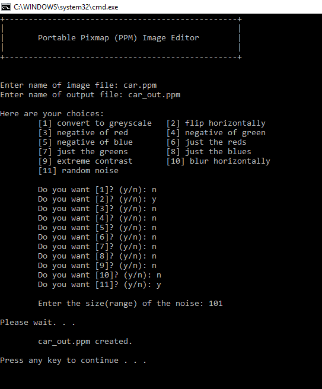

# PPM Image Editor 

## Project Summary
The program reads a PPM image file, alter the RGB elements of each pixel, and prints the resulting image as a new PPM file. 

## PPM File Format 
The PPM (or Portable Pix Map) image format is encoded in human-readable ASCII text. The image has two parts: 
- Header (metadata)
- Body (pixel values)

## Project Features 
The project implements following functionalities: 
- **`negate_red` :**  negates the red number of each pixel
- **`negate_green` :** negates the green number of each pixel
- **`negate_blue` :** negates the blue number of each pixel
-  **`flatten_red` :** sets the red value to zero
- **`flatten_green` :** sets the green value to zero
- **`flatten_blue` :** sets the blue value to zero
- **`flip_horizontal` :** flips each row horizontally
- **`grey_scale` :** sets each pixel value to the average of the three
- **`extreme_contrast` :** changes each color number to either the highest color number possible or to 0
- **`blur_horizontal` :** replaces the values of the red numbers of three adjacent pixels with their average
- **`random_noise` :** adds a random number to each color number or subtracts a random number

## User Interface
The program has a simple command line interface. 

## Sample Output 

| Original Image | Greyscale | 
| ------------- |:-------------:| 
|  |  |
| **Flip Horizontal** | **Extreme Contrast** |
|  |  |
| **Blur Horizontal** | **Negate Red** |
|  |  |
| **Flatten RG** | **Random Noise** |
|  |  |

## Reference
Further details about the project can be found [here.](http://nifty.stanford.edu/2012/guerin-image-editor/)

